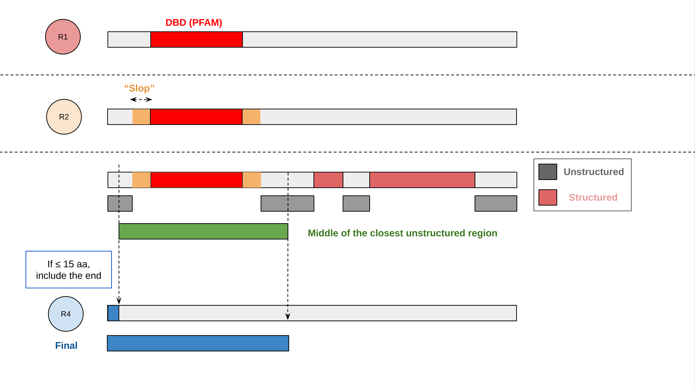

# HT-SELEX construct design 

`construct_report` is a standalone Python tool that generates a self-contained HTML report for protein construct review.
Given protein sequences, cds sequences and a bed file with domain annotations, it automatically builds putative HT-SELEX constructs by calculating the following ranges:  

1. `r1` is built from the merged domain span.
2. `r2` adds the requested `slop` on both sides.
3. `r3` expands further if compatible structure tracks contain structured runs near the `r2` boundaries.
4. If the resulting start is near the N-terminus, it can snap to residue `1`.



# Test Run 


```bash
python generate_report.py --input-dir examples/test/
```


# Manual   

## Project Layout

- `src/construct_report/`: the standalone Python package
- `generate_report.py`: simple local wrapper for running from a checkout
- `examples/`: bundled example inputs
- `pyproject.toml`: package metadata and CLI entry point

## Required Inputs

The minimal inputs are:

- `--pep`: protein FASTA
- `--cds`: CDS FASTA

Optional inputs:

- `--domains`: domain BED in protein coordinates
- `--domains-individual`: optional per-domain BED/TSV
- `--cases`: optional reference/QC table
- `--evidence-dir`: optional evidence directory with subfolders such as `conservation/`, `conservation_full/`, `structure_uniprot/`, and `structure_dssp/`

Current assumptions:

- Protein and CDS IDs should match exactly.
- Domain intervals are amino-acid coordinates, not genomic coordinates.
- Evidence tracks are mapped only by exact full-sequence match or exact substring placement.
- If `--domains-individual` is provided and contains any hits, the report includes only proteins that appear in that file.

## Evidence Directory Layout

If you provide `--evidence-dir`, the report currently expects a directory shaped like this:

```text
evidence/
  conservation/
    <protein_id>.out
    <protein_id>*.out
  conservation_full/
    <protein_id>.out
    <protein_id>*.out
  structure_dssp/
    <protein_id>.out
    <protein_id>*.out
  structure_uniprot/
    <protein_id>.out
    <protein_id>*.out
  structures/
    <protein_id>.pdb
    <protein_id>*.pdb
```

Important details:

- The loader scans the evidence root recursively for `*.out` files.
- Local structure models are loaded separately from recursive `*.pdb` files.
- A file is considered for a protein only if its basename starts with that protein ID.
- Extra directories or unsupported file types are ignored.
- `structure_dssp/` files often include an extra suffix such as `.1.out`; that is fine as long as the name still starts with the protein ID.
- The bundled example structure data are organized as `examples/evidence/structures/<protein_id>.pdb`.

## Currently Hardcoded Evidence Support

The report does not yet auto-discover arbitrary evidence types. The currently supported evidence kinds are hardcoded:

- `conservation/`
  rendered as the `Cons DBD` numeric track
- `conservation_full/`
  rendered as the `Cons full` numeric track
- `structure_dssp/`
  rendered as the `DSSP SS` structure track
- `structure_uniprot/`
  rendered as the `UniProt SS` structure track
- `structures/`
  rendered as the 3D structure viewer panel when a matching `.pdb` file is present

The hardcoding currently lives in three places inside `src/construct_report/cli.py`:

- `build_evidence_for_protein()`
  maps evidence subdirectory names to parser/mapping logic and attaches the first matching local `.pdb` model
- `preferredStructureTrack()`
  prefers `structure_dssp` over `structure_uniprot` for structure-aware range calling
- `renderEvidenceBrowser()`
  hardcodes the displayed track order, labels, colors, and row heights
- `renderStructurePanel()` / `initializeStructureViewer()`
  render the optional 3D structure panel and recolor the currently selected AA range

If you add a new evidence type, it will not appear automatically until those code paths are extended.

## Structure Viewer

If a matching file exists under `evidence/structures/`, the HTML report shows a dedicated 3D protein viewer section below the evidence tracks.

- The report currently expects `PDB` files named by protein ID prefix.
- The selected construct range is highlighted only across the part of the model that maps back onto the full protein coordinates.
- Local DSSP mapping is used first for that protein-to-model coordinate mapping, because the structure may cover only a subsequence of the full protein.
- The viewer uses the local model residue numbering only after translating the selected full-protein range through that mapping.
- The generated HTML currently loads `3Dmol.js` from `https://3Dmol.org/build/3Dmol-min.js` when the report is opened, so internet access is needed unless you vendor that script locally.

## Run From a Checkout

From this directory:

```bash
python3 generate_report.py \
  --pep examples/proteins.fasta \
  --cds examples/cds.fasta \
  --domains-individual examples/domains.individual.bed \
  --evidence-dir examples/evidence 
```

If you omit explicit inputs, the tool defaults to the bundled `examples/` folder. If you omit `--output`, it writes `report.html` to your current working directory.

On each run, the script prints a dataset summary to the terminal, including how many proteins were found in the peptide FASTA, CDS FASTA, domain inputs, evidence directory, and how many were ultimately kept in the report.

## Installable CLI

From this directory:

```bash
python3 -m pip install -e .
construct-report \
  --pep examples/proteins.fasta \
  --cds examples/cds.fasta \
  --domains-individual examples/domains.individual.bed \
  --evidence-dir examples/evidence \
  --output report.html
```

## Range Parameters

The range-calling controls are exposed on the CLI:

- `--slop`
  Number of amino acids added on both sides of `r1` to create `r2`.
- `--offset`
  Distance window used when checking whether a structured run lies close enough to either edge of `r2` to justify expansion into `r3`.
- `--min-structured-run`
  Minimum length of a continuous structured segment for it to count during the `r2 -> r3` expansion step.
- `--n-terminal-snap-threshold`
  If the structure-adjusted start of `r3` ends up close enough to the N-terminus, the tool snaps the start to residue `1`.

These feed the report’s `r1`, `r2`, and `r3` suggestions:

- `r1`: one continuous merged domain span built from all domain hits for the protein
- `r2`: `r1` expanded by `± slop`
- `r3`: structure-aware extension of `r2`


## Example Run

```bash
python3 generate_report.py --output report.html
```

That command uses the bundled `examples/` dataset and writes a standalone HTML file you can open directly in a browser.

---

## Evidence File Formats

### `conservation/` and `conservation_full/`

These are numeric per-residue tracks computed from the phylogeny pipeline alignments.  
They are suppposed to help to see which positions are conserved among the sequences from the same homology group.   

Supported formats:

1. Two-line form:

```text
SEQUENCE
0.61,0.85,0.79,...
```

2. Three-line aligned form:

```text
SEQUENCE
ALIGNMENT-WITH-GAPS
0.61,0.85,0.79,...
```

In the three-line form, gap positions in the alignment line are removed before mapping scores back onto the sequence.

### `structure_dssp/` and `structure_uniprot/`

These are secondary-structure tracks in a FASTA-like two-record format:

```text
>protein_id@sequence
SEQUENCE
>protein_id@secondary
---HHHHHTTSSPP---
```

Notes:

- The `@sequence` record is the amino-acid sequence used for mapping.
- The `@secondary` record is the DSSP-like per-residue structure string.
- The report currently treats these as structure tracks and renders them as browser lanes.

--- 


# Generate test data

## Step 1: Build the full dataset

Run once to assemble `examples/fulldata/` from the upstream probe-design results.
Paths assume the repo lives at `construct_design/construct_report/` inside the project tree.

```bash
PROBE=../../probe_design
PROTEINS=$PROBE/data/Nvec_v4_merged_proteins.fasta
CDS=$PROBE/data/Nvec_v4_merged_CDS.fasta   # CDS-only FASTA, starts at ATG

samtools faidx "$PROTEINS"
samtools faidx "$CDS"

mkdir -p examples/fulldata
cat "$PROBE"/results/search/tfs.*.domains.csv.tmp2 > examples/fulldata/domains.individual.bed

xargs samtools faidx "$PROTEINS" < <(cut -f1 examples/fulldata/domains.individual.bed | sort -u) \
  > examples/fulldata/proteins.fasta
xargs samtools faidx "$CDS"      < <(cut -f1 examples/fulldata/domains.individual.bed | sort -u) \
  > examples/fulldata/cds.fasta

samtools faidx examples/fulldata/proteins.fasta
samtools faidx examples/fulldata/cds.fasta
```

> **Note:** Use `Nvec_v4_merged_CDS.fasta`, not `Nvec_v4_merged_transcripts.fasta`.
> The transcripts file includes 5′ UTR, so frame-0 translation does not match the protein.
> A small number of older `v1g*` gene models may still show a mismatch due to annotation
> version differences between the protein and CDS FASTAs; these are upstream data issues.

## Step 2: Build the test subset (30 proteins)

Sources for evidence files:

| Evidence | Source path |
|----------|-------------|
| PDB structures | `~/ant/gzolotarov/projects/2021_TFevol/folding/results_nvec/{ID}.1.alphafold.pdb` |
| pLDDT scores | `~/ant/gzolotarov/projects/2021_TFevol/folding/results_nvec/{ID}.1_plddt_mqc.tsv` |
| Conservation (DBD) | `~/Documents/projects/2025_nvec_motif/probe_design/results/conservation/{ID}.out` |
| Conservation (full) | `~/Documents/projects/2025_nvec_motif/probe_design/results/conservation_full/{ID}.out` |
| DSSP structure | `~/Documents/projects/2025_nvec_motif/probe_design/results/structure/{ID}.out` |

```bash
bash make_test_data.sh
```

Then run the report against the test subset:

```bash
python3 generate_report.py \
  --pep examples/test/proteins.fasta \
  --cds examples/test/cds.fasta \
  --domains-individual examples/test/domains.individual.bed \
  --evidence-dir examples/test/evidence \
  --output report.html
```
